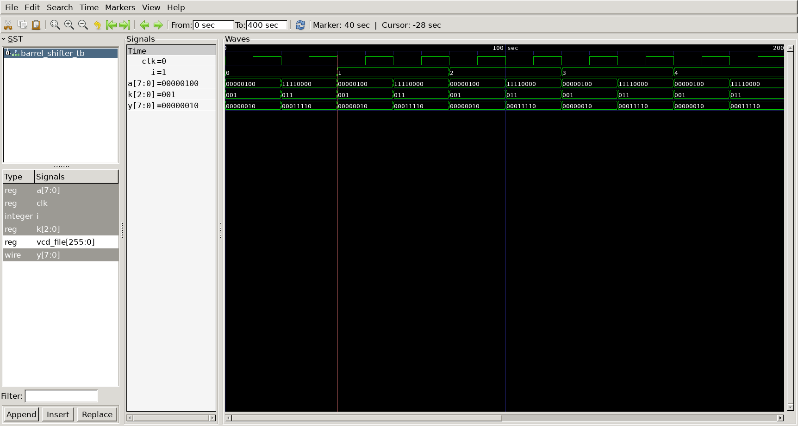

# Barrel shifter
## control signal

- k : rotate amount

## Curcuit diagram


## DUT
```
module barrel_shifter(
	input 	[7:0] a,
	input 	[2:0] k,
	output 	[7:0] y
);

	wire [7:0] storage0;
	wire [7:0] storage1;
	wire [7:0] storage2;

	// storage2 : 4bit shift 
	assign storage2[0] = k[2] ? a[4] : a[0];
	assign storage2[1] = k[2] ? a[5] : a[1];
	assign storage2[2] = k[2] ? a[6] : a[2];
	assign storage2[3] = k[2] ? a[7] : a[3];
	assign storage2[4] = k[2] ? a[0] : a[4];
	assign storage2[5] = k[2] ? a[1] : a[5];
	assign storage2[6] = k[2] ? a[2] : a[6];
	assign storage2[7] = k[2] ? a[3] : a[7];

	// storage1 : 2bit shift 
	assign storage1[0] = k[1] ? storage2[2] : storage2[0];
	assign storage1[1] = k[1] ? storage2[3] : storage2[1];
	assign storage1[2] = k[1] ? storage2[4] : storage2[2];
	assign storage1[3] = k[1] ? storage2[5] : storage2[3];
	assign storage1[4] = k[1] ? storage2[6] : storage2[4];
	assign storage1[5] = k[1] ? storage2[7] : storage2[5];
	assign storage1[6] = k[1] ? storage2[0] : storage2[6];
	assign storage1[7] = k[1] ? storage2[1] : storage2[7];

	// storage0 : 1bit shift 
	assign storage0[0] = k[0] ? storage1[1] : storage1[0];
	assign storage0[1] = k[0] ? storage1[2] : storage1[1];
	assign storage0[2] = k[0] ? storage1[3] : storage1[2];
	assign storage0[3] = k[0] ? storage1[4] : storage1[3];
	assign storage0[4] = k[0] ? storage1[5] : storage1[4];
	assign storage0[5] = k[0] ? storage1[6] : storage1[5];
	assign storage0[6] = k[0] ? storage1[7] : storage1[6];
	assign storage0[7] = k[0] ? storage1[0] : storage1[7];

	// final output 
	assign y = storage0;

endmodule
```

## Testbench
```
`include "barrel_shifter.v"
`define  SIMCYCLE 10
`define  CLKFREQ  50

module barrel_shifter_tb;

	reg 		  clk;
	reg 	[7:0] a;
	reg 	[2:0] k;
	wire 	[7:0] y;

	barrel_shifter
	u_barrel_shifter(
		.a					(a					),
		.k					(k					),
		.y					(y					)
	);

//----------------------------------------------
// Clock 
//----------------------------------------------
	
 	always #(500/`CLKFREQ) clk = ~clk;

//----------------------------------------------
// Tasks  
//----------------------------------------------
	
	task init;
		begin 
			clk = 0;
			a 	= 0;
			k 	= 0; 
		end 
	endtask

//----------------------------------------------
// Test Stimulus   
//----------------------------------------------
	
	integer i;
	initial begin 
		init();
		
		for(i=0; i<`SIMCYCLE; i++) begin 
			
			a = 8'b0000_0100;
			k = 3'h1;

			@(posedge clk);
			#10;

			a = 8'b1111_0000;
			k = 3'h3;

			@(posedge clk);
			#10;
			
			a = 8'b0101_0101;
			k = 3'h1;

		end
	$finish;
	end 

//---------------------------------------------
// Dump VCD  
//---------------------------------------------

    reg [8*32-1:0] vcd_file;
    initial begin
        if($value$plusargs("vcd_file=%s", vcd_file)) begin
            $dumpfile(vcd_file);
            $dumpvars;
        end else begin
            $dumpfile("barrel_shifter_tb.vcd");
            $dumpvars;
        end
    end
endmodule 
```

## Simulation Results

- @40sec
  a = 8'b0000_0100 --> a = 8'b0000_0010


