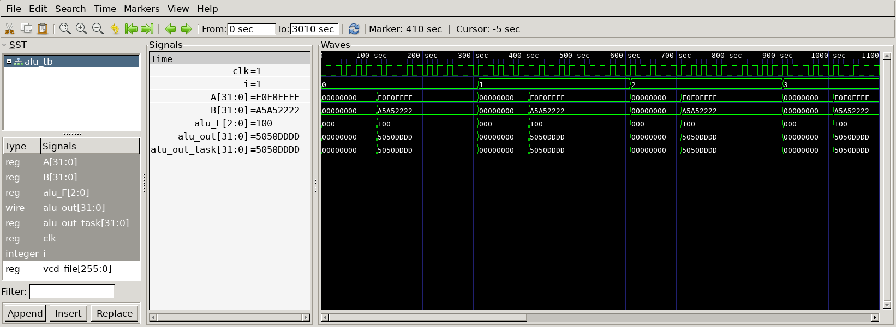

# ALU
## Curcuit diagram 


## Using modules 
- 2to1 MUX
- AND
- OR
- multi bit adder 
- 4to1 MUX

## DUT 
```
// 2 to 1 MUX
module MUX_2to1(
	input  [31:0]  B,
	input  [31:0]  not_B,
	input  		   mux2_F,
	output [31:0]  mux2_out
);

	assign mux2_out = (mux2_F == 3'h1) ? not_B : B;

endmodule 

// multi-bit adder 
module adder(
	input  [31:0]  adder_A,
	input  [31:0]  adder_B,
	input  		   adder_F,
	output [31:0]  adder_sum,
	output 		   adder_cout
);
//	wire mux_out;

	assign {adder_cout, adder_sum} = adder_A + adder_B + adder_F;

endmodule

// AND 
module AND(
	input  [31:0] AND_A,
	input  [31:0] AND_B,
	output [31:0] and_out
);	

	assign and_out = AND_A & AND_B;

endmodule

// OR 
module OR(
	input  [31:0] OR_A,
	input  [31:0] OR_B,
	output [31:0] or_out
);
			
	assign or_out = OR_A | OR_B;

endmodule

// 4 to 1 MUX 
module MUX_4to1(
	input  [31:0] O,
	input  [31:0] P,
	input  [31:0] Q,
	input  [31:0] R,
	input  	[1:0] mux4_F,
	output [31:0] mux4_out
);
   	assign mux4_out = ((mux4_F) == (2'd0)) ? O  :
					  ((mux4_F) == (2'd1)) ? P 	:
					  ((mux4_F) == (2'd2)) ? Q	: 
				 	  						 R	; 
endmodule

module ALU(
	input  [31:0] 	A,
	input  [31:0]	B,
	input  [2:0]	alu_F,
	output [31:0]	alu_out
);

	wire [31:0] not_B;
	wire [31:0] mux2_out;

	assign not_B = ~B;

	wire [31:0] R;
	assign R = {31'b0, adder_sum[31]};   // zero extend 

	wire [31:0] mux4_out;
	wire [31:0] and_out;
	wire [31:0] or_out;
	wire [31:0] adder_sum;
	wire 		adder_cout;


	MUX_2to1
	u_MUX_2to1(
		.B					(B					),
		.not_B				(not_B				),
		.mux2_F				(alu_F[2]			),
		.mux2_out			(mux2_out			)
	);

	AND
	u_AND(
		.AND_A				(A					),
		.AND_B				(mux2_out			),
		.and_out			(and_out			)
	);

	OR
	u_OR(
		.OR_A				(A		  			),
		.OR_B				(mux2_out			),
		.or_out				(or_out				)
	);

	adder
	u_adder(
		.adder_A			(A					),
		.adder_B			(mux2_out			),
		.adder_F			(alu_F[2]			),
		.adder_sum			(adder_sum			),
		.adder_cout			(adder_cout			)
	);

	MUX_4to1
	u_MUX_4to1(
		.O					(and_out			),
		.P					(or_out				),
		.Q					(adder_sum			),
		.R					(R					),
		.mux4_F				(alu_F[1:0]			),
		.mux4_out			(mux4_out			)
	);
	assign alu_out = mux4_out;
endmodule
```

## Testbench
```
`include "alu.v"
`define SIMCYCLE 10
`define CLKFREQ 50

module alu_tb;
	
   	reg 			clk;
	reg 	[31:0]	A;
	reg 	[31:0] 	B;
	reg 	[2:0]	alu_F;
	wire 	[31:0]	alu_out;
	reg 	[31:0] alu_out_task;

ALU u_ALU(
	.A 			(A),
	.B		 	(B),
	.alu_F		(alu_F),
	.alu_out	(alu_out)
);

//-----------------------------------------
// Clock 
//-----------------------------------------
	
	always #(500/`CLKFREQ) clk = ~clk;

//-----------------------------------------
// Tasks 
//-----------------------------------------
	
	task init_func;
		begin
			A		=	0;
			B		=	0;
			alu_F	=	0;
			clk		=   0;
			alu_out_task = 0;
		end
	endtask

	task and_func;
		input [31:0] A;
		input [31:0] B;
		output [31:0] Y;
			begin 
				Y = A & B;
			end 
	endtask

	task or_func;
		input [31:0] A;
		input [31:0] B;
		output [31:0] Y;
			begin 
				Y = A | B;
			end 
	endtask

	task add_func;
		input [31:0] A;
		input [31:0] B;
		output [31:0] Y;
			begin 
				Y = A + B;
			end 
	endtask

	task not_use;
		input [31:0] A;
		input [31:0] B;
		output [31:0] Y;
			begin 
				Y = 0;
			end 
	endtask

	task and_bar_func;
		input [31:0] A;
		input [31:0] B;
		output [31:0] Y;
			begin 
				Y = A & ~B;
			end 
	endtask

	task or_bar_func;
		input [31:0] A;
		input [31:0] B;
		output [31:0] Y;
			begin 
				Y = A | ~B;
			end 
	endtask
	
	task sub_func;
		input [31:0] A;
		input [31:0] B;
		output [31:0] Y;
			begin 
				Y = A - B;
			end 
	endtask

	task slt_func;
	    input [31:0] A;
		input [31:0] B;
		output [31:0] Y;
			begin
				if(A < B) begin 
					 Y = 1;
				end else begin 
					 Y = 0;
				end 
			end 
	endtask

//---------------------------------------------
// Test Stimulus 
//---------------------------------------------

	always @(alu_F) begin
		case(alu_F)
			3'b000 : and_func(A, B, alu_out_task);
			3'b001 : or_func(A, B, alu_out_task);
			3'b010 : add_func(A, B, alu_out_task);
			3'b100 : and_bar_func(A, B, alu_out_task);
			3'b101 : or_bar_func(A, B, alu_out_task);
			3'b110 : sub_func(A, B, alu_out_task);
			3'b111 : slt_func(A, B, alu_out_task);
			default : not_use(A, B, alu_out_task);
		endcase
	end
	
	integer i;
	initial begin
		for(i=0; i<`SIMCYCLE; i++) begin 
		init_func();
		
	 	@(posedge clk); 
		#100;

		A 		= 32'hF0F0_FFFF;
		B		= 32'hA5A5_2222;
		alu_F 	= 3'b100;

		@(posedge clk);
		#100;

		if(alu_out_task != alu_out) begin
			$display("ERROR! expected : %d, real : %d", alu_out_task, alu_out); 
		end
		
		@(posedge clk); 
		#100;
	end
		$finish;

	end

//--------------------------------------------
// Dump VCD 
//--------------------------------------------
	reg [8*32-1:0] vcd_file;
	initial begin
		if($value$plusargs("vcd_file=%s", vcd_file)) begin
			$dumpfile(vcd_file);
			$dumpvars;
		end else begin 
			$dumpfile("ALU_tb.vcd");
			$dumpvars;
		end
	end

endmodule 
```

## Simulation Results

- @410sec
  - a = 32'hF0F0_FFFF, b = 32'hA5A5_2222 
  - alu_F = 3'b100(= and_bar_func)
  
  -> expected : 32'h5050_DDDD 
  -> real : 32'h5050_DDDD
  ---> expected == real 


