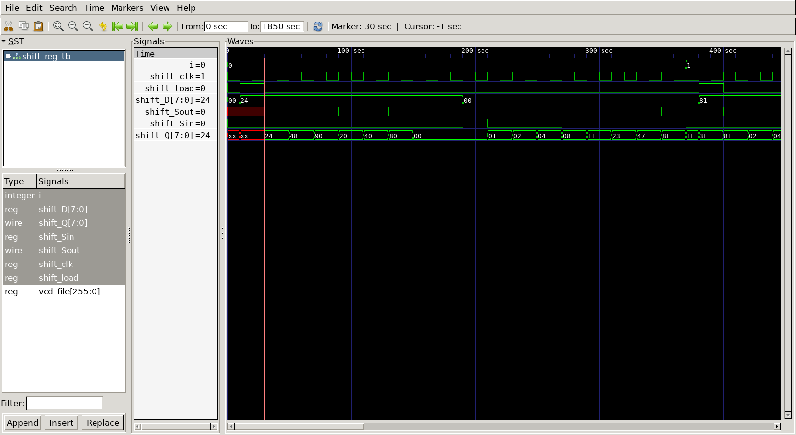

# Shift Register 

## Curcuit diagram 


## DUT
```
module mux(
	input	mux_Sin,
	input   mux_D,
	input   mux_load,
	output  mux_out
);
	assign mux_out = (mux_load == 0) ?  mux_Sin : mux_D;

endmodule

module ff(
	input  ff_clk,
	input  ff_Sin,
	output reg ff_out
);

	always @(posedge ff_clk) 
	begin 
		ff_out <= ff_Sin;
	end
endmodule

module shift_reg(
	input 			shift_load,
	input			shift_clk,

	input			shift_Sin,
	output  [7:0]	shift_Q,

	input   [7:0]	shift_D,
	output 	    	shift_Sout
);

	reg	  mux_Sin;
	reg   mux_D;
	reg   mux_load;
	wire  [7:0] mux_out;
	
	reg  ff_clk;
	reg  ff_Sin;
	reg  ff_out;   // wire 

	mux
	u_mux0(
		.mux_Sin			(shift_Sin			),
		.mux_D				(shift_D[0]			),
		.mux_load			(shift_load			),
		.mux_out			(mux_out[0]			)
	);
	mux
	u_mux1(
		.mux_Sin			(shift_Q[0]			),
		.mux_D				(shift_D[1]			),
		.mux_load			(shift_load			),
		.mux_out			(mux_out[1]			)
	);
	mux
	u_mux2(
		.mux_Sin			(shift_Q[1]			),
		.mux_D				(shift_D[2]			),
		.mux_load			(shift_load			),
		.mux_out			(mux_out[2]			)
	);
	mux
	u_mux3(
		.mux_Sin			(shift_Q[2]			),
		.mux_D				(shift_D[3]			),
		.mux_load			(shift_load			),
		.mux_out			(mux_out[3]			)
	);
	mux
	u_mux4(
		.mux_Sin			(shift_Q[3]			),
		.mux_D				(shift_D[4]			),
		.mux_load			(shift_load			),
		.mux_out			(mux_out[4]			)
	);
	mux
	u_mux5(
		.mux_Sin			(shift_Q[4]			),
		.mux_D				(shift_D[5]			),
		.mux_load			(shift_load			),
		.mux_out			(mux_out[5]			)
	);
	mux
	u_mux6(
		.mux_Sin			(shift_Q[5]			),
		.mux_D				(shift_D[6]			),
		.mux_load			(shift_load			),
		.mux_out			(mux_out[6]			)
	);
	mux
	u_mux7(
		.mux_Sin			(shift_Q[6]			),
		.mux_D				(shift_D[7]			),
		.mux_load			(shift_load			),
		.mux_out			(mux_out[7]			)
	);

// ---------------------------------------------------FF 

	ff
	u_ff0(
		.ff_clk				(shift_clk			),
		.ff_Sin				(mux_out[0] 		),
		.ff_out				(shift_Q[0]			)
	);
	ff
	u_ff1(
		.ff_clk				(shift_clk			),
		.ff_Sin				(mux_out[1]			),
		.ff_out				(shift_Q[1]			)
	);
	ff
	u_ff2(
		.ff_clk				(shift_clk			),
		.ff_Sin				(mux_out[2]			),
		.ff_out				(shift_Q[2]			)
	);
	ff
	u_ff3(
		.ff_clk				(shift_clk			),
		.ff_Sin				(mux_out[3]			),
		.ff_out				(shift_Q[3]			)
	);
	ff
	u_ff4(
		.ff_clk				(shift_clk			),
		.ff_Sin				(mux_out[4]			),
		.ff_out				(shift_Q[4]			)
	);
	ff
	u_ff5(
		.ff_clk				(shift_clk			),
		.ff_Sin				(mux_out[5]			),
		.ff_out				(shift_Q[5]			)
	);
	ff
	u_ff6(
		.ff_clk				(shift_clk			),
		.ff_Sin				(mux_out[6]			),
		.ff_out				(shift_Q[6]			)
	);
	ff
	u_ff7(
		.ff_clk				(shift_clk			),
		.ff_Sin				(mux_out[7]			),
		.ff_out				(shift_Q[7]			)
	);
			assign shift_Sout = shift_Q[7];
endmodule
```

## Testbench
```
`define CLKFREQ  	50
`define SIMCYCLE    5

`include "shift_reg.v"

module shift_reg_tb;

	reg 			shift_load;
	reg				shift_clk;
	reg				shift_Sin;
	wire  [7:0]		shift_Q;
	reg   [7:0]		shift_D;
	wire			shift_Sout;

	shift_reg
	u_shift_reg(
		.shift_load			(shift_load			),
		.shift_clk			(shift_clk			),
		.shift_Sin			(shift_Sin			),
		.shift_Q			(shift_Q			),
		.shift_D			(shift_D			),
		.shift_Sout			(shift_Sout			)
	);

//--------------------------------------------
// Clock
//--------------------------------------------

	always #(500/`CLKFREQ) shift_clk = ~shift_clk;
	
//--------------------------------------------
// Tasks
//--------------------------------------------

	task init;
		begin 
		 	shift_load = 1'b0;
			shift_clk  = 1'b0;
			shift_Sin  = 1'b0;
			shift_D	   = 8'b0;
		end 
	endtask

	task PtoS;
		begin
			shift_Sin  = 1'b0;
			shift_D	   = $urandom;
			shift_load = 1'b1;

			@(posedge shift_clk) 
			shift_load = 1'b0;
			repeat(8) @(posedge shift_clk);
		end
	endtask

	task StoP;
		begin 
			shift_D    = 8'b0;
			shift_load = 1'b0;
			
			// shift_Sin = 1F
		//	@(posedge shift_clk);
			shift_Sin = 1'b1;
			@(posedge shift_clk);
			shift_Sin = 1'b0;
			@(posedge shift_clk);
			shift_Sin = 1'b0;
			@(posedge shift_clk);
			shift_Sin = 1'b0;
			@(posedge shift_clk);
			shift_Sin = 1'b1;
			@(posedge shift_clk);
			shift_Sin = 1'b1;
			@(posedge shift_clk);
			shift_Sin = 1'b1;
			@(posedge shift_clk);
			shift_Sin = 1'b1;
			repeat (2) @(posedge shift_clk);
		end 
	endtask

//--------------------------------------------
// Test stimulus
//--------------------------------------------
	integer i;	
	initial begin
		for(i=0; i<`SIMCYCLE; i=i+1) begin

			init();
			@(posedge shift_clk);

			PtoS();

			StoP();
		end 
			$finish;
	end 


// ---------------------------------------------------
// Dump VCD
// ---------------------------------------------------

	reg [8*32-1:0] vcd_file;
	initial begin
		if($value$plusargs("vcd_file=%s", vcd_file)) begin
			$dumpfile(vcd_file);
			$dumpvars;
		end else begin 
			$dumpfile("shift_reg_tb.vcd");
			$dumpvars;
		end
	end
endmodule
```

## Simulation Results

- @10sec
  - load = 1 : parallel to serial ([7:0] D --> Sout)
   - @30sec(load = 0) : shift_Sout = 0
   - @50sec : shift_Sout = 0 
   - @70sec : shift_Sout = 1
   - @90sec : shift_Sout = 0
   - @110sec : shift_Sout = 0
   - @130sec : shift_Sout = 1
   - @150sec : shift_Sout = 0
   - @170sec : shift_Sout = 0
====> shift_D(8'h24) --> shift_Sout(0010_0100)


- @190sec
  - load = 0 : serial to parallel (Sin --> [7:0] Q), Sin = 1
   - @210sec : Sin = 0 
   - @230sec : Sin = 0
   - @250sec : Sin = 0
   - @270sec : Sin = 1
   - @290sec : Sin = 1
   - @310sec : Sin = 1
   - @330sec : Sin = 1
====> shift_Sin(1000_1111) --> shift_Q(8F) 


