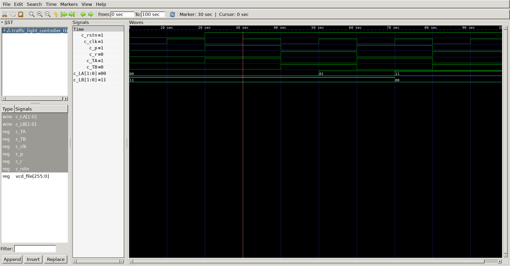

# FSM - traffic light controller 
## Curcuit diagram


## Condition
- P = 1 : enter parade mode & bravado Blvd light stays GREEN
- R = 1 : leave parade mode 

## DUT
```
//-----------------------------------------
// lights_FSM
//-----------------------------------------
module lights_FSM(
	input TA,
	input TB, 
	input lights_M,
	input lights_rstn,
	input lights_clk,
	output  [1:0] LB,
	output  [1:0] LA
);
	
	reg  [1:0] LB;		// load Bravado_Blvd
	reg  [1:0] LA; 		// load Academic_Ave

	reg  [1:0] lights_cstate;
	reg  [1:0] lights_nstate;

	parameter RED    = 2'b11;
	parameter YELLOW = 2'b01;
	parameter GREEN  = 2'b00;

	parameter S0 = 2'b00;
	parameter S1 = 2'b01;
	parameter S2 = 2'b10;
	parameter S3 = 2'b11;


	always @(posedge lights_clk or negedge lights_rstn) begin 
		if(!lights_rstn) begin 
			lights_cstate <= S0;
		end else begin 
			lights_cstate <= lights_nstate;
		end 
	end 
// next state logic
	always @(*) begin 
		case (lights_cstate) 
			S0 : begin 
				if(TA) begin  // TA=1
					lights_nstate = S0;
				end else begin  // TA=0
					lights_nstate = S1;
				end 
			end 
			S1 : begin 
					lights_nstate = S2;
				end 
			S2: begin 
				if (lights_M | TB) begin 
					lights_nstate = S2;
				end else begin
					lights_nstate = S3;
				end 
			end 
			S3 : begin 
					lights_nstate = S0;
				end 
		endcase 
	end

// output logic - LA
    always @(*) begin 
		case (lights_cstate)
			S0 : LA = GREEN;  	// 00
			S1 : LA = YELLOW;   // 01
			S2 : LA = RED;   	// 11
			S3 : LA = RED;  	// 11
		endcase 
	end 

// output logic - LB
    always @(*) begin 
		case (lights_cstate)
			S0 : LB = RED;
			S1 : LB = RED;
			S2 : LB = GREEN;
			S3 : LB = YELLOW;
		endcase 
	end 
endmodule

//-----------------------------------------
// mode_FSM
//-----------------------------------------

module mode_FSM(
	input P, 
	input R, 
	input mode_rstn,
	input mode_clk,
	output reg mode_M
);

	reg  [1:0] mode_cstate;
	reg  [1:0] mode_nstate;

	parameter S0 = 2'b00;
	parameter S1 = 2'b01;

	always @(posedge mode_clk or negedge mode_rstn) begin 
		if(!mode_rstn) begin 
			mode_cstate <= S0;
		end else begin 
			mode_cstate <= mode_nstate;
		end 
	end 

// next state logic
	always @(*) begin 
		case (mode_cstate)
			S0 : begin 
				if(P) begin    // p=1
					mode_nstate = S1;
				end else begin // p=0
					mode_nstate = S0;
				end
			end
			S1 : begin 
				if(R) begin  // R=1
					mode_nstate = S0;
				end else begin // R=0
					mode_nstate = S1;
				end 
			end 
		endcase 
	end 

// output state logic 	 
	always @(*) begin 
		case (mode_cstate)
			S0 : mode_M = 0;
			S1 : mode_M = 1; 
		endcase
	end 
endmodule

module traffic_light_controller(
	input c_p,
	input c_r,
	input c_TA,
	input c_TB,
	input c_clk,
	input c_rstn,

	output [1:0] c_LA,
	output [1:0] c_LB

);

	reg TA;
	reg TB; 
	reg lights_M;
	reg lights_rstn;
	reg lights_clk;
	wire  [1:0] LB;
	wire  [1:0] LA;

	reg P; 
	reg R; 
	reg mode_rstn;
	reg mode_clk;
	wire mode_M;

	mode_FSM
	u_mode_FSM(
		.P					(c_p				),
		.R					(c_r				),
		.mode_rstn			(c_rstn				),
		.mode_clk			(c_clk				),
		.mode_M				(mode_M				)
	);

	lights_FSM
	u_lights_FSM(
		.TA					(c_TA				),
		.TB					(c_TB				),
		.lights_M			(mode_M	     		),
		.lights_rstn		(c_rstn				),
		.lights_clk			(c_clk				),
		.LB					(c_LB				),
		.LA					(c_LA				)
	);

endmodule
```

## Testbench
```
`include "traffic_light_controller.v"

`define CLKFREQ 50
`define SIMCYCLE 10

module traffic_light_controller_tb;

	reg c_p;
	reg c_r;
	reg c_TA;
	reg c_TB;
	reg c_clk;
	reg c_rstn;
	wire [1:0] c_LA;
	wire [1:0] c_LB;

	traffic_light_controller
	u_traffic_light_controller(
		.c_p				(c_p				),
		.c_r				(c_r				),
		.c_TA				(c_TA				),
		.c_TB				(c_TB				),
		.c_clk				(c_clk				),
		.c_rstn				(c_rstn				),
		.c_LA				(c_LA				),
		.c_LB				(c_LB				)
	);


//-----------------------------------------
// Clock
//-----------------------------------------
	always #(500/`CLKFREQ) c_clk = ~c_clk;
//-----------------------------------------
// Tasks
//-----------------------------------------
	task init;
		begin 
			c_p = 0;
			c_r = 0;
            c_TA = 0;
            c_TB = 0;
            c_clk = 0;
            c_rstn = 0;
		end 
	endtask
//-----------------------------------------
// Test Stimulus 
//-----------------------------------------

	integer i;
	initial begin 
		init();
				@(posedge c_clk);
				#10;
				c_rstn = 1;

				c_p = 1'b1;
				c_TA = 1'b1;
				c_r = 1'b0;
				c_TB = 1'b0;
				
				@(posedge c_clk); 
				#10;
					
				c_p = 1'b0;
				c_TA = 1'b0;
				c_r = 1'b1;
				c_TB = 1'b1;
			
				@(posedge c_clk); 
				#10;
				
				c_p = 1'b1;
				c_TA = 1'b1;
				c_r = 1'b0;
				c_TB = 1'b0;
				
				@(posedge c_clk); 
				#10;
			
				c_p = 1'b0;
				c_TA = 1'b0;
				c_r = 1'b1;
				c_TB = 1'b1;
			
				@(posedge c_clk); 
				#10;
			$finish;
		end 
		
// ---------------------------------------------------
// Dump VCD
// ---------------------------------------------------

	reg [8*32-1:0] vcd_file;
	initial begin
		if($value$plusargs("vcd_file=%s", vcd_file)) begin
			$dumpfile(vcd_file);
			$dumpvars;
		end else begin 
			$dumpfile("traffic_light_controller_tb.vcd");
			$dumpvars;
		end
	end
endmodule
```

## Simulation Results


- @30sec
  - LA : GREEN(00)
  - LB : RED(11)
- @50sec
  - LA : YELLOW(01)
  - LB : RED(11)
- @70sec
  - LA : RED(11)
  - LB : GREEN(00)
- @90sec 
  - LA : RED(11)
  - LB : GREEN(00)


