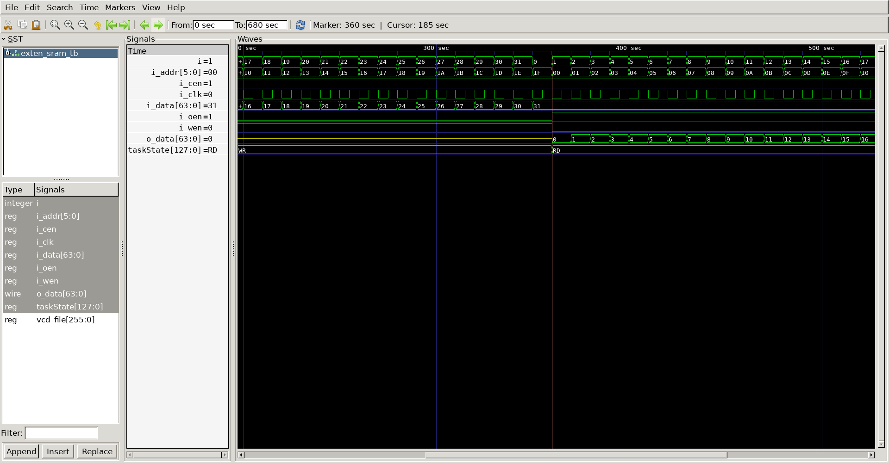

# SRAM extension

## Extension 
- SRAM unit : 4bit adder & 32bit I/O data  ==> 6bit adder & 64bit I/O data
  - 2bit address(SRAM select) -> 00,01,10,11
  - 00 : data[63:32], data[31:0]
  - 01 : data[63:32], data[31:0]
  - 10 : data[63:32], data[31:0]
  - 11 : data[63:32], data[31:0]

## DUT - SRAM
```
module sram 
#(
	parameter BW_DATA = 32,
	parameter BW_ADDR = 4
)
(
	input 	[BW_DATA-1:0] i_data,
	input 	[BW_ADDR-1:0] i_addr,
	input 			      i_wen, 
	input 				  i_cen,
	input 			   	  i_oen,
	input 				  i_clk,
	output 	[BW_DATA-1:0] o_data
);

	reg 	[BW_DATA-1:0] mem[0:2**BW_ADDR-1];
	always @(posedge i_clk) begin 
		if(i_cen && i_wen) begin 
			mem[i_addr] <= i_data;
		end else begin 
			mem[i_addr] <= mem[i_addr];
		end 
	end 

	//Memory read
	`ifdef SPSRAM_ASYNC  
		assign o_data	= !i_oen		 ? 'bz : 
						  i_cen && !i_wen ? mem[i_addr] : 'bx;

	 `else
		 reg	[BW_DATA-1:0] o_data;
		 always @(posedge i_clk) begin
			 if(i_oen) begin 
				 if(i_cen && !i_wen) begin 
					 o_data  <= mem[i_addr];
				 end else begin
					 o_data  <= 'bx;
				 end 
			 end else begin 
				 	 o_data  <= 'bz;
			 end
		 end
	 `endif

endmodule
```

## DUT - Extern SRAM
```
`include "sram.v"

module exten_sram 
#(
	parameter BW_DATA = 64,
	parameter BW_ADDR = 6
)
(
	input 	[BW_DATA-1:0] i_data,   
	input 	[BW_ADDR-1:0] i_addr,   
	input 			      i_wen, 
	input 				  i_cen,
	input 			   	  i_oen,
	input 				  i_clk,
	output 	[BW_DATA-1:0] o_data
);

	wire bit_00, bit_01, bit_10, bit_11;
	
	assign bit_00 = (i_addr[5:4] == 2'b00);
	assign bit_01 = (i_addr[5:4] == 2'b01);
	assign bit_10 = (i_addr[5:4] == 2'b10);
	assign bit_11 = (i_addr[5:4] == 2'b11);


	sram
	#(
		.BW_DATA			(32					),
		.BW_ADDR			(4					)
	)
	u_sram0(
		.i_data				(i_data[63:32] 		),
		.i_addr				(i_addr[3:0]		),
		.i_wen				(i_wen				),
		.i_cen				(i_cen && bit_00		),
		.i_oen				(i_oen && bit_00		),
		.i_clk				(i_clk				),
		.o_data				(o_data[63:32]		)
	);

	sram
	#(
		.BW_DATA			(32					),
		.BW_ADDR			(4					)
	)
	u_sram1(
		.i_data				(i_data[31:0]		),
		.i_addr				(i_addr[3:0]		),
		.i_wen				(i_wen				),
		.i_cen				(i_cen && bit_00		),
		.i_oen				(i_oen && bit_00		),
		.i_clk				(i_clk				),
		.o_data				(o_data[31:0]		)
	);

	sram
	#(
		.BW_DATA			(32					),
		.BW_ADDR			(4					)
	)
	u_sram2(
		.i_data				(i_data[63:32]		),
		.i_addr				(i_addr[3:0]		),
		.i_wen				(i_wen				),
		.i_cen				(i_cen && bit_01		),
		.i_oen				(i_oen && bit_01 	),
		.i_clk				(i_clk				),
		.o_data				(o_data[63:32]		)
	);

	sram
	#(
		.BW_DATA			(32					),
		.BW_ADDR			(4					)
	)
	u_sram3(
		.i_data				(i_data[31:0]		),
		.i_addr				(i_addr[3:0]		),
		.i_wen				(i_wen				),
		.i_cen				(i_cen && bit_01		),
		.i_oen				(i_oen && bit_01		),
		.i_clk				(i_clk				),
		.o_data				(o_data[31:0]		)
	);

	sram
	#(
		.BW_DATA			(32					),
		.BW_ADDR			(4					)
	)
	u_sram4(
		.i_data				(i_data[63:32]		),
		.i_addr				(i_addr[3:0]		),
		.i_wen				(i_wen				),
		.i_cen				(i_cen && bit_10		),
		.i_oen				(i_oen && bit_10		),
		.i_clk				(i_clk				),
		.o_data				(o_data[63:32]		)
	);

	sram
	#(
		.BW_DATA			(32					),
		.BW_ADDR			(4					)
	)
	u_sram5(
		.i_data				(i_data[31:0]		),
		.i_addr				(i_addr[3:0]		),
		.i_wen				(i_wen				),
		.i_cen				(i_cen && bit_10		),
		.i_oen				(i_oen && bit_10		),
		.i_clk				(i_clk				),
		.o_data				(o_data[31:0]		)
	);

	sram
	#(
		.BW_DATA			(32					),
		.BW_ADDR			(4					)
	)
	u_sram6(
		.i_data				(i_data[63:32]		),
		.i_addr				(i_addr[3:0]		),
		.i_wen				(i_wen				),
		.i_cen				(i_cen && bit_11		),
		.i_oen				(i_oen && bit_11		),
		.i_clk				(i_clk				),
		.o_data				(o_data[63:32]		)
	);

	sram
	#(
		.BW_DATA			(32					),
		.BW_ADDR			(4					)
	)
	u_sram7(
		.i_data				(i_data[31:0]		),
		.i_addr				(i_addr[3:0]		),
		.i_wen				(i_wen				),
		.i_cen				(i_cen && bit_11		),
		.i_oen				(i_oen && bit_11		),
		.i_clk				(i_clk				),
		.o_data				(o_data[31:0]		)
	);
endmodule
```

## Testbench
```
`define CLKFREQ		100
`define SIMCYCLE	32

`define BW_DATA		64
`define BW_ADDR		6

`define SPSRAM_ASYNC

`include "exten_sram.v"


module exten_sram_tb;


	reg 	[`BW_DATA-1:0] i_data;   
	reg 	[`BW_ADDR-1:0] i_addr;   
	reg 			       i_wen; 
	reg 				   i_cen;
	reg 			   	   i_oen;
	reg 				   i_clk;
	wire 	[`BW_DATA-1:0] o_data;

	exten_sram
	#(
		.BW_DATA			(`BW_DATA			),
		.BW_ADDR			(`BW_ADDR			)
	)
	u_exten_sram(
		.i_data				(i_data				),
		.i_addr				(i_addr				),
		.i_wen				(i_wen				),
		.i_cen				(i_cen				),
		.i_oen				(i_oen				),
		.i_clk				(i_clk				),
		.o_data				(o_data				)
	);

//--------------------------------------------
// Clock
//--------------------------------------------

	always #(500/`CLKFREQ) i_clk = ~i_clk;
	
//--------------------------------------------
// Task
//--------------------------------------------

	reg [4*32-1:0] taskState;

	task init;
		begin 
			i_data = 0;	
            i_addr = 0;	
            i_wen  = 0;  
            i_cen  = 0;  
            i_oen  = 0;  
            i_clk  = 0; 
		end
	endtask

	task memWR;
			input [63:0] testi_addr;
			input [5:0] testi_data;
			begin 
				@(negedge i_clk) begin 
					taskState	= "WR";
					i_data		= testi_data;
					i_addr		= testi_addr;
					i_wen		= 1;
					i_cen		= 1;
					i_oen		= 0;
				end
			end
	endtask

	task memRD;
			input [63:0] testi_addr;
			begin 
				@(negedge i_clk) begin 
					taskState	= "RD";
					i_addr		= testi_addr;
					i_wen		= 0;
					i_cen		= 1;
					i_oen		= 1;
				end
			end
	endtask

//--------------------------------------------
// Test stimulus 
//--------------------------------------------
	integer i, j;
	initial begin
		init();
		#(4*1000/`CLKFREQ);

		for(i=0; i<2**5; i++) begin
			memWR(i, i);
		end
		for(i=0; i<2**5; i++) begin
			memRD(i);
		end
		#(1000/`CLKFREQ);
		$finish;
	end

//---------------------------------------------
// Dump VCD  
//---------------------------------------------

    reg [8*32-1:0] vcd_file;
    initial begin
        if($value$plusargs("vcd_file=%s", vcd_file)) begin
            $dumpfile(vcd_file);
            $dumpvars;
        end else begin
            $dumpfile("exten_sram_tb.vcd");
            $dumpvars;
        end
    end
endmodule
```

## Simulation results

- ASYNC : signal RD --> o_data change
  (no wait posedge i_clk) 


